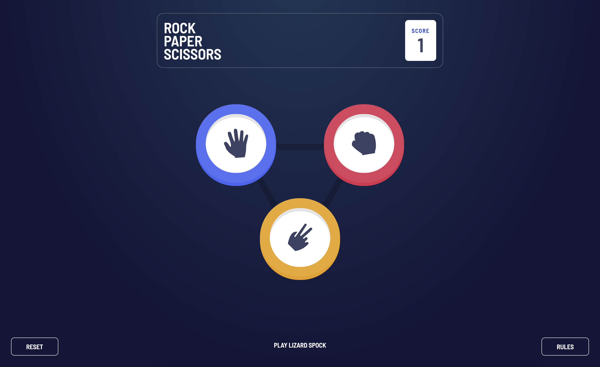

# Frontend Mentor - Rock, Paper, Scissors solution

Mike Cheshire's (@mixchex) solution to the [Rock, Paper, Scissors challenge on Frontend Mentor](https://www.frontendmentor.io/challenges/rock-paper-scissors-game-pTgwgvgH). 
## Table of contents

- [Overview](#overview)
  - [The challenge](#the-challenge)
  - [Screenshot](#screenshot)
  - [Links](#links)
- [My process](#my-process)
  - [Built with](#built-with)
  - [What I learned](#what-i-learned)
- [Author](#author)
- [Acknowledgments](#acknowledgments)

## Overview
I decided to try out this advanced challenge and showcase my front-end development skills. I included the bonus option of playing Rock, Paper, Scissors, Lizard, Spock as an option and the game also remembers your score by using the localStorage API.
### The challenge

Users should be able to:

- View the optimal layout for the game depending on their device's screen size
- Play Rock, Paper, Scissors against the computer
- Maintain the state of the score after refreshing the browser _(optional)_
- **Bonus**: Play Rock, Paper, Scissors, Lizard, Spock against the computer _(optional)_

### Screenshot

### Links

- Challenge URL: <https://www.frontendmentor.io/challenges/rock-paper-scissors-game-pTgwgvgH>
- Solution URL: <https://mixchex.github.io/fementor-rock-paper-scissors/>
## My process
I decided to focus on React JS as the JavaScript framework to further develop my skills as well as use Tailwind CSS which I enjoy using and developing with. I wanted to also include localStorage after using it recently.
### Built with

- Semantic HTML5 markup
- CSS custom properties
- CSS Animations
- localStorage API
- Flexbox
- Mobile-first workflow
- [React](https://reactjs.org/) - JS library
- [Tailwind CSS](<https://tailwindcss.com/>) - CSS framework

**Note: These are just examples. Delete this note and replace the list above with your own choices**

### What I learned
Overall I did not learn much from this build other than further understanding the flexibiltiy of the Tailwind CSS framework where specifically I liked finding how radial gradients can be added to the config file for a gradient other than a linear one.
## Author

- Website - [Mike Cheshire](https://www.mikecheshire.com)
- Frontend Mentor - [@mixchex](https://www.frontendmentor.io/profile/mixchex)
- Twitter - [@mixchex](https://www.twitter.com/mixchex)

## Acknowledgments

The React JS and Tailwind CSS teams - they're doing an amazing job for the development community pushing the web forward. :)
